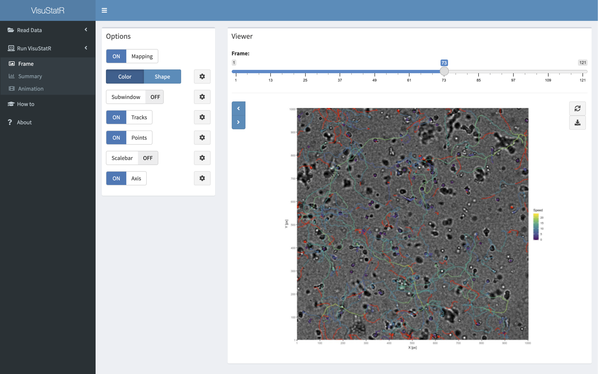

# VisuStatR - Visualizing Motility and Morphology Statistics on Images in R
 
Live-cell microscopy has become an essential tool for analyzing dynamic processes in various biological applications. To critically assess the influence of individual cells on the calculated summary statistics, and to detect heterogeneous cell populations or possible confounding factors, such as misclassified or -tracked objects, a direct mapping of gained statistical information onto the actual image data is necessary. VisuStatR allows to visualize time-resolved motility parameters or any other summary statistic onto images in R. Originally, this package was intended to be used with live-cell microscopy images and cell-tracking data. But in general VisuStatR can be used with any kind of data supplying a dataframe with trackIds, time and spatial coordinates (2D/3D), as well as numeric or discrete mapping parameters and corresponding images.

### Intention and concept of the software tool
VisuStatR is especially designed for experimentalists and non-expert users to allow the visual inspection of their tracking and imaging data. The package does not perform automatic image analysis or object tracking itself. It rather allows the combined visualization of raw imaging data with calculated summary statistics to explain specific characteristics and evaluate possible artifacts. Thereby, it supports imaging and tracking software, such as Fiji/TrackMate (Schindelin et al., *Nat. Meth.* 2012, Berg et al. *Nat. Meth.* 2019), and analysis tools, such as CelltrackR (Wortel et al., *ImmunoInf.* 2021), by allowing the combined visualization of their individual outputs within the raw image data. To this end, VisuStatR is able to select and zoom-in on specific objects and tracks using different display modes.


As input VisuStatR requires:  

- the original stacks of 2D/3D images analyzed (with VisuStatR supporting `tiff`, `png`, and `jpeg` or any other image format supported by the `magick` library)  
- the obtained tracking data  
- the summary statistics that are evaluated on the image data  
- when using the Shiny app the tracking data and summary statistics need to be supplied as a `csv`-file  

The package acts as a wrapper for annotating provided images with several, modifiable `ggplot2`-layers. With `visustat_frame()`, continous and discrete parameters can be mapped individually on color, shape and size for one timepoint. `visustat_summary()` allows to create a corresponding plot of all given statistics for the whole range of the provided data. A time-resolved image-series can be created with `visustat_all()` which allows to combine mapped frames and summary plots created by `visustat_frame()` and `visustat_summary()`. The output of all functions are `ggplot2`-objects which can further be manipulated in a common manner.

## Display modes

### Mapping color and shape
VisuStatR allows for several display modes. The most common is shown above where the complete image is captured and one continuous parameter is mapped on the track color. In addition, it is also possible to map discrete variables on shape and/or color or continuous variables on size and/or alpha. In this example, contact-state and infection-status of tracked cells were mapped to color and shape.


### Color-mapping combined with summary statistics
Each output-type of `visustat_frame()` can be combined with the output from `visustat_summary()`.


### Follow single tracks within sub-windows
The output of `visustat_frame()` does not need to be the whole image. It can be cropped manually or automatically or create sub-windows that allow to follow individual tracks, that might be interesting due to prior performed statistical analysis that highlighted for example outliers.


### 3D images and Z-projections
VisuStatR supports `tiff`-stacks of 3D image data as input. Since `ggplot2` just works in 2D, the user can choose from different Z-projections to view the data in 2D. All output modes work with 3D-image data. In addition, it is possible to follow several individual tracks on their respective Z-axis in parallel.

### GUI: Shiny App
In addition to the functionality as an R-package, VisuStatR can be completely used within a Shiny-app by calling `visustat_shiny()`. The Shiny-app acts as an graphical-user interface and allows to import and prepare tracking and image data as well as process these with all VisuStatR functionalities. In contrast to using VisuStatR in an IDE or terminal, the Shiny-app adds a much more interactive way of data-analysis and allows users that are not proficient with the R language to process their data with VisuStatR.



## Install VisuStatR

VisuStatR was developed as an R-package under version 4.0.4 and requires the previous installation of R  (https://cran.r-project.org). It depends on the R packages *tidyverse, ggplot2, plotly, Rmisc, cowplot, doSNOW, facetscales, foreach, ggecho, grid, gridExtra, magick, parallel, shiny, shinydashboard* and *rlang*. 
Some of the packages are not available on CRAN and need to be installed via *devtools* before the installation of VisuStatR. This includes *facetscales* and *ggecho*. 


```{r}
# If devtools is not already installed:
install.packages(“devtools”)

# install dependencies which are not found on CRAN
devtools::install_github("zeehio/facetscales")
remotes::install_github("coolbutuseless/ggecho")
```

VisuStatR is then installed directly from GitHub via the following command:

```{r}
# install VisuStatR from git repo
devtools::install_git("https://github.com/grrchrr/VisuStatR")
```
More information on the individual functions and the required inputs can be found within the documentation at https://grrchrr.github.io/VisuStatR/reference/index.html.

